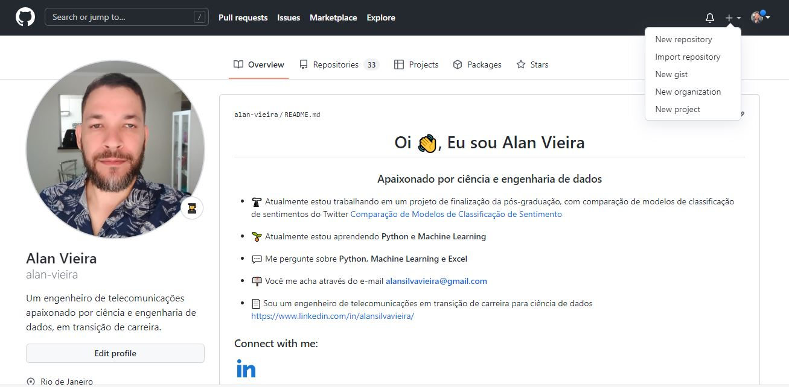
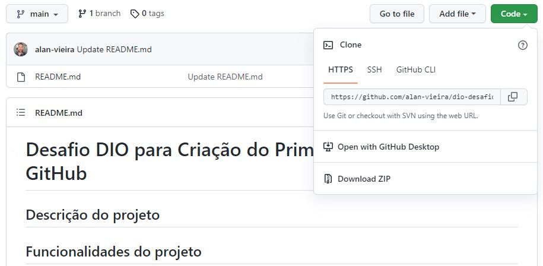
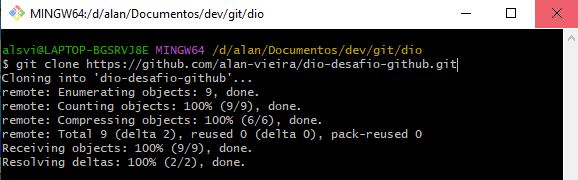
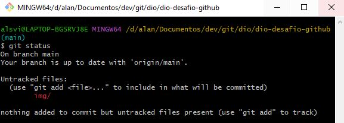
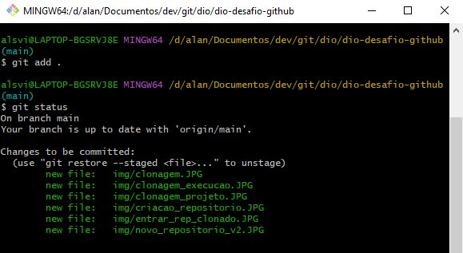
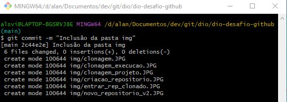
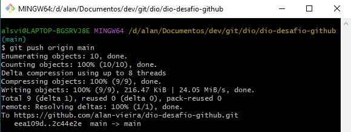

# Desafio DIO para Criação do Primeiro Repositório GitHub
## Descrição do projeto


## Funcionalidades do projeto

- `Funcionalidade 1`: Criação do repositório no GitHub
- `Funcionalidade 2`: Clonagem do repositóri para pasta local
- `Funcionalidade 3`: Criação e atualização de arquivos dentro da pasta local
- `Funcionalidade 4`: Marcação dos arquivos contidos no repositório clonado para monitoramento do git
- `Funcionalidade 5`: Inclusão de comentário nos arquivos locais, para posteriormente envio ao repositório remoto, no github
- `Funcionalidade 6`: Envido das atualizações para o github


## Aplicação

- Passo 1: Criação do novo repositório do GitHub




- Passo 2: Clonagem do novo repositório



- Passo 3: Abrir o gitbash dentro da pasta que receberá o repositóri clonado e executar o comando de clonagem.

```bash
git clone https://github.com/alan-vieira/dio-desafio-github-primeiro-repositorio.git
```


- Passo 4: Após algumas alterações realizadas nos arquivos contidos no repositório clonado, execute o comando git status para constatar tais mudanças.

```bash
git status
```


- Passo 5: Para marcar todos os arquivos que serão monitorados na pasta, execute o comando git add.

```bash
git add .
```


- Passo 6: Para adicionar um comentário nos arquivos que foram modificados, exexute o comando git commit, seguido do comentário entre aspas.

```bash
git commit -m "Inclusão das anotações do curso de Git/GitHub"
```



- Passo 7: Para enviar os arquivos atualizados para o repositório remoto no GitHub, execute o comento git push.

```bash
git push origin main
```    


## Ferramentas utilizadas
- `Git`
- `GitHub`

## Autor

| [<br><sub>Alan Vieira</sub>](https://github.com/alan-vieira) |
| :---: |
